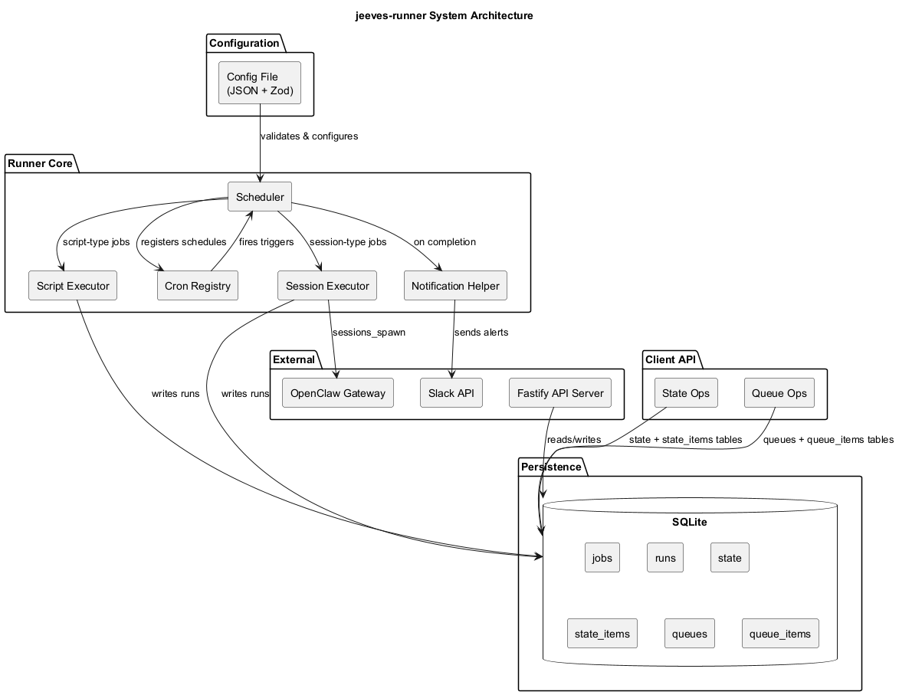
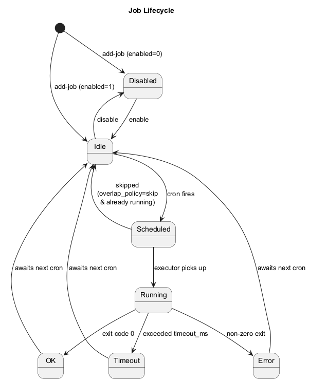

# Jeeves Runner 🎩

[](https://www.npmjs.com/package/@karmaniverous/jeeves-runner)

[](https://github.com/karmaniverous/jeeves-runner/tree/main/LICENSE.md)

Graph-aware job execution engine with SQLite state. Part of the [Jeeves platform](#the-jeeves-platform).

## Monorepo Structure

This repository is a monorepo containing two packages:

| Package | npm | Description |
|---------|-----|-------------|
| [`packages/service`](packages/service) | [`@karmaniverous/jeeves-runner`](https://www.npmjs.com/package/@karmaniverous/jeeves-runner) v0.3.1 | Job execution engine |
| [`packages/openclaw`](packages/openclaw) | [`@karmaniverous/jeeves-runner-openclaw`](https://www.npmjs.com/package/@karmaniverous/jeeves-runner-openclaw) v0.1.0 | OpenClaw plugin |

## What It Does

jeeves-runner schedules and executes jobs, tracks their state in SQLite, and exposes status via a REST API. It replaces both n8n and Windows Task Scheduler as the substrate for data flow automation.

**Key properties:**

- **Domain-agnostic.** The runner knows graph primitives (source, sink, datastore, queue, process, auth), not business concepts. "Email polling" and "meeting extraction" are just jobs with scripts.
- **SQLite-native.** Job definitions, run history, state, and queues live in a single SQLite file. No external database, no Redis.
- **Zero new infrastructure.** One Node.js process, one SQLite file. Runs as a system service via NSSM (Windows) or systemd (Linux).
- **Scripts as config.** Job scripts live outside the runner repo at configurable absolute paths. The runner is generic; the scripts are instance-specific.

## Architecture



### Stack

| Component | Technology |
|-----------|-----------|
| Runtime | Node.js v24+ (uses built-in `node:sqlite`) |
| Scheduler | [croner](https://www.npmjs.com/package/croner) |
| Database | SQLite via `node:sqlite` |
| Process isolation | `child_process.spawn` |
| HTTP API | [Fastify](https://fastify.dev/) |
| Logging | [pino](https://getpino.io/) |
| Config validation | [Zod](https://zod.dev/) |

## Installation

```bash
npm install @karmaniverous/jeeves-runner
```

Requires Node.js 24+ for `node:sqlite` support.

## Quick Start

### 1. Create a config file

```json
{
  "port": 1937,
  "dbPath": "./data/runner.sqlite",
  "maxConcurrency": 4,
  "runRetentionDays": 30,
  "stateCleanupIntervalMs": 3600000,
  "reconcileIntervalMs": 60000,
  "shutdownGraceMs": 30000,
  "gateway": {
    "url": "http://localhost:3000",
    "tokenPath": "./credentials/gateway-token"
  },
  "notifications": {
    "slackTokenPath": "./credentials/slack-bot-token",
    "defaultOnFailure": "YOUR_SLACK_CHANNEL_ID",
    "defaultOnSuccess": null
  },
  "log": {
    "level": "info",
    "file": "./data/runner.log"
  }
}
```

### 2. Start the runner

```bash
npx jeeves-runner start --config ./config.json
```

### 3. Add a job

Jobs are registered via the CLI or a seed script — there is no `schedule.json`.

```bash
npx jeeves-runner add-job \
  --id my-job \
  --name "My Job" \
  --schedule "*/5 * * * *" \
  --script /absolute/path/to/script.js \
  --config ./config.json
```

Or programmatically via `scripts/seed-jobs.ts`.

### 4. Check status

```bash
npx jeeves-runner status --config ./config.json
npx jeeves-runner list-jobs --config ./config.json
```

## CLI Commands

| Command | Description |
|---------|-------------|
| `start` | Start the runner daemon |
| `status` | Show runner stats (queries the HTTP API) |
| `list-jobs` | List all configured jobs |
| `add-job` | Add a new job to the database |
| `trigger` | Manually trigger a job run (queries the HTTP API) |
| `validate` | Validate a config file |
| `init` | Initialize a new runner config and database |
| `config-show` | Display the resolved config |
| `service install` | Install as an NSSM service (Windows) |
| `service uninstall` | Uninstall the NSSM service |

All commands accept `--config <path>` to specify the config file.

## HTTP API

The runner exposes a REST API on `localhost` (not externally accessible by default).

| Method | Path | Description |
|--------|------|-------------|
| `GET` | `/health` | Health check |
| `GET` | `/jobs` | List all jobs with last run status |
| `GET` | `/jobs/:id` | Single job detail |
| `GET` | `/jobs/:id/runs` | Run history (paginated via `?limit=N`) |
| `POST` | `/jobs/:id/run` | Trigger manual run |
| `POST` | `/jobs/:id/enable` | Enable a job |
| `POST` | `/jobs/:id/disable` | Disable a job |
| `GET` | `/stats` | Aggregate stats (jobs ok/error/running counts) |

### Example response

```json
// GET /jobs
{
  "jobs": [
    {
      "id": "email-poll",
      "name": "Poll Email",
      "schedule": "*/11 * * * *",
      "enabled": 1,
      "last_status": "ok",
      "last_run": "2026-02-24T10:30:00"
    }
  ]
}
```

## SQLite Schema

Six tables manage all runner state:

### `jobs` — Job Definitions

Each job has an ID, name, cron schedule, script path, and behavioral configuration.

| Column | Type | Description |
|--------|------|-------------|
| `id` | TEXT PK | Job identifier (e.g. `email-poll`) |
| `name` | TEXT | Human-readable name |
| `schedule` | TEXT | Cron expression |
| `script` | TEXT | Absolute path to script |
| `type` | TEXT | `script` or `session` (LLM dispatcher) |
| `enabled` | INTEGER | 1 = active, 0 = paused |
| `timeout_ms` | INTEGER | Kill after this duration (null = no limit) |
| `overlap_policy` | TEXT | `skip` (default) or `allow` |
| `on_failure` | TEXT | Slack channel ID for failure alerts |
| `on_success` | TEXT | Slack channel ID for success alerts |

### `runs` — Run History

Every execution is recorded with status, timing, output capture, and optional token tracking.

| Column | Type | Description |
|--------|------|-------------|
| `id` | INTEGER PK | Auto-incrementing run ID |
| `job_id` | TEXT FK | References `jobs.id` |
| `status` | TEXT | `pending`, `running`, `ok`, `error`, `timeout`, `skipped` |
| `duration_ms` | INTEGER | Wall-clock execution time |
| `exit_code` | INTEGER | Process exit code |
| `tokens` | INTEGER | LLM token count (session jobs only) |
| `result_meta` | TEXT | JSON from `JR_RESULT:{json}` stdout lines |
| `stdout_tail` | TEXT | Last 100 lines of stdout |
| `stderr_tail` | TEXT | Last 100 lines of stderr |
| `trigger` | TEXT | `schedule`, `manual`, or `retry` |

Runs older than `runRetentionDays` are automatically pruned.

### `state` — Scalar State

General-purpose key-value store with optional TTL. Scripts use `getState`/`setState`/`deleteState` to track cursors, checkpoints, or any operational state.

| Column | Type | Description |
|--------|------|-------------|
| `namespace` | TEXT | Logical grouping (typically job ID) |
| `key` | TEXT | State key |
| `value` | TEXT | State value (string or JSON) |
| `expires_at` | TEXT | Optional TTL (ISO timestamp, auto-cleaned) |

### `state_items` — Collection State

Collection-oriented state store for tracking sets of items (e.g., seen thread IDs, processed message IDs).

| Column | Type | Description |
|--------|------|-------------|
| `namespace` | TEXT | Logical grouping (typically job ID) |
| `key` | TEXT | Collection key |
| `item_key` | TEXT | Individual item identifier |
| `value` | TEXT | Item value (string or JSON) |
| `expires_at` | TEXT | Optional TTL (ISO timestamp, auto-cleaned) |

### `queues` — Queue Metadata

Queue-level configuration including deduplication and retention policies.

| Column | Type | Description |
|--------|------|-------------|
| `id` | TEXT PK | Queue identifier |
| `dedup_config` | TEXT | JSON deduplication configuration |
| `retention` | TEXT | JSON retention policy |

### `queue_items` — Work Queue Items

Priority-ordered work queues with claim semantics. SQLite's serialized writes prevent double-claims.

| Column | Type | Description |
|--------|------|-------------|
| `id` | INTEGER PK | Auto-incrementing item ID |
| `queue_id` | TEXT FK | References `queues.id` |
| `payload` | TEXT | JSON blob |
| `status` | TEXT | `pending`, `claimed`, `done`, `error` |
| `priority` | INTEGER | Higher = more urgent |
| `attempts` | INTEGER | Delivery attempt count |
| `max_attempts` | INTEGER | Maximum retries |

## Job Scripts

Jobs are plain Node.js scripts executed as child processes. The runner passes context via environment variables:

| Variable | Description |
|----------|-------------|
| `JR_DB_PATH` | Path to the runner SQLite database |
| `JR_JOB_ID` | ID of the current job |
| `JR_RUN_ID` | ID of the current run |

### Structured output

Scripts can emit structured results by writing a line to stdout:

```
JR_RESULT:{"tokens":1500,"meta":"processed 42 items"}
```

The runner parses this and stores the data in the `runs` table.

### Client library

Job scripts can import the runner client for state and queue operations:

```typescript
import { createClient } from '@karmaniverous/jeeves-runner';

const jr = createClient(); // reads JR_DB_PATH from env

// Scalar state (key-value with optional TTL)
const lastId = jr.getState('email-poll', 'last_history_id');
jr.setState('email-poll', 'last_history_id', newId);
jr.setState('email-poll', 'checkpoint', value, { ttl: '30d' });
jr.deleteState('email-poll', 'old_key');

// Collection state (tracking sets of items)
jr.setItem('email-poll', 'seen-threads', threadId, '1', { ttl: '30d' });
const seen = jr.hasItem('email-poll', 'seen-threads', threadId);
const item = jr.getItem('email-poll', 'seen-threads', threadId);
jr.deleteItem('email-poll', 'seen-threads', threadId);
const count = jr.countItems('email-poll', 'seen-threads');
const keys = jr.listItemKeys('email-poll', 'seen-threads');
jr.pruneItems('email-poll', 'seen-threads'); // remove expired

// Queues
jr.enqueue('email-updates', { threadId, action: 'label' });
const items = jr.dequeue('email-updates', 10); // claim up to 10
jr.done(items[0].id);
jr.fail(items[1].id, 'API error');

jr.close();
```

## Job Lifecycle



### Overlap policies

| Policy | Behavior |
|--------|----------|
| `skip` | Don't start if already running (default) |
| `allow` | Run concurrently |

### Concurrency

A global semaphore limits concurrent jobs (default: 4, configurable via `maxConcurrency`). When the limit is hit, behavior follows the job's overlap policy.

### Notifications

Slack notifications are sent via direct HTTP POST to `chat.postMessage` (no SDK dependency):

- **Failure:** `⚠️ *Job Name* failed (12.3s): error message`
- **Success:** `✅ *Job Name* completed (3.4s)`

Notifications require a Slack bot token (file path in config). Each job can override the default notification channels.

## Maintenance

The runner automatically performs periodic maintenance:

- **Run pruning:** Deletes run records older than `runRetentionDays` (default: 30).
- **State cleanup:** Deletes expired state entries (runs every `stateCleanupIntervalMs`, default: 1 hour).
- **Job reconciliation:** Reconciles job schedules with the database (runs every `reconcileIntervalMs`, default: 60 seconds).

All tasks run on startup and at the configured interval.

## Programmatic Usage

```typescript
import { createRunner, runnerConfigSchema } from '@karmaniverous/jeeves-runner';

const config = runnerConfigSchema.parse({
  port: 1937,
  dbPath: './data/runner.sqlite',
});

const runner = createRunner(config);
await runner.start();

// Graceful shutdown
process.on('SIGTERM', () => runner.stop());
```

## Configuration Reference

| Key | Type | Default | Description |
|-----|------|---------|-------------|
| `port` | number | `1937` | HTTP API port |
| `dbPath` | string | `./data/runner.sqlite` | SQLite database path |
| `maxConcurrency` | number | `4` | Max concurrent jobs |
| `runRetentionDays` | number | `30` | Days to keep run history |
| `stateCleanupIntervalMs` | number | `3600000` | State cleanup interval (ms) |
| `reconcileIntervalMs` | number | `60000` | Job reconciliation interval (ms) |
| `shutdownGraceMs` | number | `30000` | Grace period for running jobs on shutdown |
| `gateway.url` | string | — | OpenClaw Gateway URL (for session jobs) |
| `gateway.tokenPath` | string | — | Path to gateway auth token file |
| `notifications.slackTokenPath` | string | — | Path to Slack bot token file |
| `notifications.defaultOnFailure` | string \| null | `null` | Default Slack channel for failures |
| `notifications.defaultOnSuccess` | string \| null | `null` | Default Slack channel for successes |
| `log.level` | string | `info` | Log level (trace/debug/info/warn/error/fatal) |
| `log.file` | string | — | Log file path (stdout if omitted) |

## OpenClaw Plugin

The `@karmaniverous/jeeves-runner-openclaw` package provides an OpenClaw plugin that exposes runner management tools to your agent. See the [OpenClaw Integration Guide](packages/openclaw/guides/openclaw-integration.md) for setup and usage.

## The Jeeves Platform

jeeves-runner is one component of a four-part platform:

| Component | Role | Status |
|-----------|------|--------|
| **jeeves-runner** | Execute: run processes, move data through the graph | This package |
| **[jeeves-watcher](https://github.com/karmaniverous/jeeves-watcher)** | Index: observe file-backed datastores, embed in Qdrant | Shipped |
| **jeeves-server** | Present: UI, API, file serving, search, dashboards | Shipped |
| **Jeeves skill** | Converse: configure, operate, and query via chat | Planned |

## Project Status

**Phase 1: Complete.** Job scheduling, status reporting, state management, and queue operations are fully functional. NSSM service deployed. OpenClaw plugin shipped.

### What's built

- ✅ SQLite schema (jobs, runs, state, state_items, queues, queue_items)
- ✅ Cron scheduler with overlap policies and concurrency limits
- ✅ Job executor with output capture, timeout enforcement, and `JR_RESULT` parsing
- ✅ Client library for state and queue operations from job scripts
- ✅ Slack notifications for job success/failure
- ✅ REST API (Fastify) for job management and monitoring
- ✅ CLI for daemon management and job operations
- ✅ Maintenance tasks (run pruning, state cleanup, job reconciliation)
- ✅ Zod-validated configuration
- ✅ Seed script for 27 existing n8n workflows
- ✅ NSSM service deployment
- ✅ OpenClaw plugin (`@karmaniverous/jeeves-runner-openclaw` v0.1.0)
- ✅ Monorepo restructure complete
- ✅ 103 passing tests (83 service + 20 plugin)

### What's next

- [ ] jeeves-server dashboard page (`/runner`)
- [ ] Migrate jobs from n8n one by one
- [ ] Retire n8n

### Future phases

| Feature | Phase |
|---------|-------|
| Graph topology (nodes/edges schema) | 2 |
| Credential/auth management | 2 |
| REST API for graph mutations | 2 |
| Container packaging | 3 |

## Development

```bash
npm install
npx lefthook install

npm run lint        # ESLint + Prettier
npm run test        # Vitest
npm run knip        # Unused code detection
npm run build       # Rollup (ESM + types + CLI)
npm run typecheck   # TypeScript (noEmit)
```

## License

BSD-3-Clause

---

Built for you with ❤️ on Bali by [Jason Williscroft](https://github.com/karmaniverous) & [Jeeves](https://github.com/jgs-jeeves).

