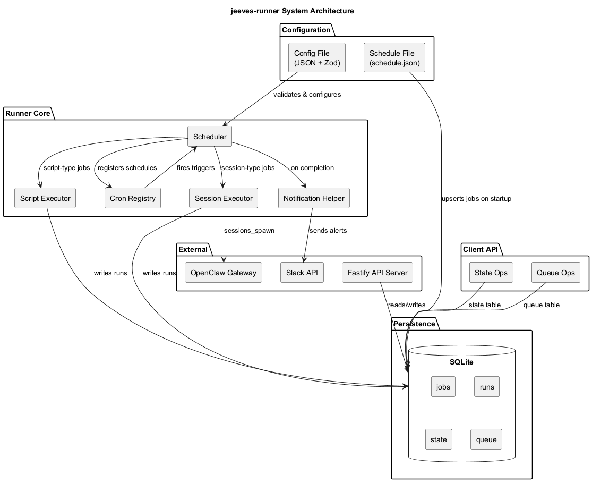
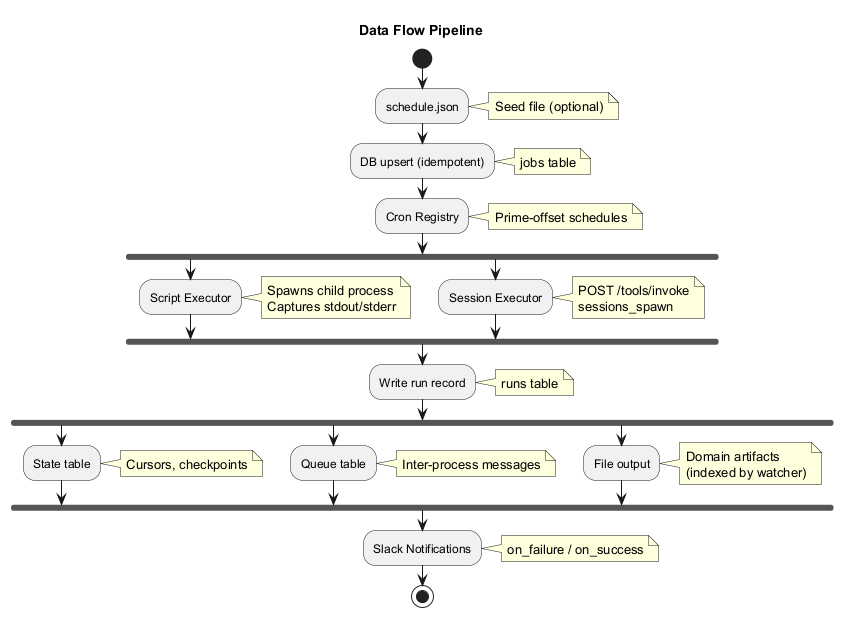

# Architecture

High-level architectural overview of `jeeves-runner` for contributors and advanced users.

## Design Principles

1. **Graph-aware, domain-agnostic** — The runner knows about sources, sinks, datastores, queues, and processes. It does not know about "emails" or "meetings."
2. **SQLite is the source of truth** — Jobs, runs, state, and queues all live in a single SQLite database.
3. **Two execution modes** — Script jobs spawn child processes; session jobs dispatch to the OpenClaw Gateway.
4. **File + table duality** — Datastores that produce artifacts for indexing or serving use the filesystem; operational state uses SQLite.
5. **Schedule-driven** — All job execution is driven by cron expressions with prime-offset scheduling to spread load.

---

## System Architecture

The runner consists of several layered components:

- **Configuration Layer** — Zod-validated config with sensible defaults
- **Scheduler Layer** — Cron registry, job reconciliation, and execution dispatching
- **Execution Layer** — Script executor (child processes) and session executor (Gateway dispatch)
- **Persistence Layer** — SQLite database with jobs, runs, state, and queue tables
- **API Layer** — Fastify HTTP server for job management and monitoring
- **Client API** — Programmatic access to state and queue operations
- **Notification Layer** — Slack integration for job completion alerts

---

## Job Lifecycle

Jobs transition through these states:

1. **Disabled** — Job exists but will not be scheduled
2. **Idle** — Job is enabled and waiting for the next cron trigger
3. **Scheduled** — Cron has fired; job is queued for execution
4. **Running** — Executor is actively running the job
5. **OK** — Job completed successfully (exit code 0)
6. **Error** — Job failed (non-zero exit code or exception)
7. **Timeout** — Job exceeded its configured timeout

### Overlap Policy

Each job has an `overlap_policy`:
- **skip** (default) — If the job is already running when the next cron fires, the new run is skipped
- **allow** — Multiple instances can run concurrently

---

## Data Flow

### Schedule Ingestion

On startup, the runner reads `schedule.json` (if configured) and upserts jobs into the SQLite `jobs` table. This is an idempotent seed — the database is the live source of truth after startup.

### Execution Pipeline

1. **Cron Registry** fires at the scheduled time
2. **Scheduler** checks overlap policy and concurrency limits
3. **Executor** dispatches the job:
   - **Script jobs**: spawns a child process with the configured script path
   - **Session jobs**: calls the OpenClaw Gateway `/tools/invoke` endpoint with `sessions_spawn`
4. **Run record** is written to the `runs` table with status, duration, exit code, stdout/stderr
5. **Notifications** are sent via Slack if configured (per-job or default channels)

### State and Queue Tables

Scripts can persist state and exchange data through the runner's client API:

- **State table** — Key-value store with optional TTL. Scripts use `getState`/`setState`/`deleteState` to track cursors, checkpoints, or any operational state.
- **Queue table** — Ordered buffer with claim semantics. Producers enqueue items; consumers claim and complete them. Used for inter-process data passing.

---

## SQLite Schema

### `jobs` Table

Stores job configuration. Seeded from `schedule.json` on startup, mutable via API.

| Column | Type | Description |
|--------|------|-------------|
| `id` | TEXT PK | Unique job identifier |
| `name` | TEXT | Human-readable name |
| `schedule` | TEXT | Cron expression |
| `script` | TEXT | Absolute path to executable script |
| `type` | TEXT | `script` or `session` |
| `enabled` | INTEGER | 1 = enabled, 0 = disabled |
| `timeout_ms` | INTEGER | Timeout in milliseconds (null = no timeout) |
| `overlap_policy` | TEXT | `skip` or `allow` |
| `on_failure` | TEXT | Slack channel for failure alerts |
| `on_success` | TEXT | Slack channel for success alerts |

### `runs` Table

Stores execution history. Automatically pruned based on `runRetentionDays`.

| Column | Type | Description |
|--------|------|-------------|
| `id` | INTEGER PK | Auto-increment run ID |
| `job_id` | TEXT FK | References `jobs.id` |
| `started_at` | TEXT | ISO 8601 timestamp |
| `finished_at` | TEXT | ISO 8601 timestamp |
| `status` | TEXT | `ok`, `error`, or `timeout` |
| `exit_code` | INTEGER | Process exit code |
| `stdout` | TEXT | Captured standard output |
| `stderr` | TEXT | Captured standard error |
| `duration_ms` | INTEGER | Execution duration |

### `state` Table

Key-value store for script operational state.

| Column | Type | Description |
|--------|------|-------------|
| `key` | TEXT PK | State key |
| `value` | TEXT | JSON-encoded value |
| `expires_at` | TEXT | Optional TTL timestamp |

### `queue` Table

Ordered message queue with claim semantics.

| Column | Type | Description |
|--------|------|-------------|
| `id` | INTEGER PK | Auto-increment |
| `queue_name` | TEXT | Queue identifier |
| `payload` | TEXT | JSON-encoded payload |
| `status` | TEXT | `pending`, `claimed`, `completed`, `failed` |
| `created_at` | TEXT | Enqueue timestamp |
| `claimed_at` | TEXT | Claim timestamp |
| `completed_at` | TEXT | Completion timestamp |

---

## Gateway Integration

Session-type jobs delegate execution to the OpenClaw Gateway:

1. Runner reads the gateway `url` and `tokenPath` from config
2. On trigger, the session executor calls `POST /tools/invoke` with `sessions_spawn`
3. The gateway creates an isolated agent session that executes the task
4. Results flow back through the gateway response

**Requirement:** The gateway must have `sessions_spawn` in `gateway.tools.allow` (it is on the default HTTP deny list).
