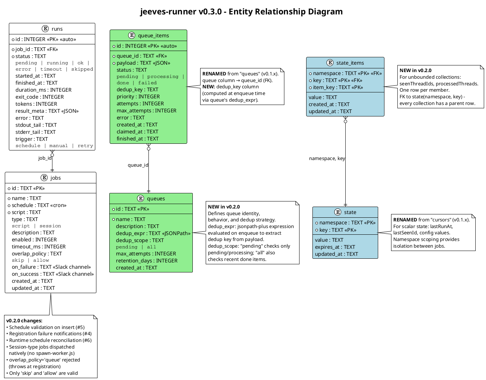
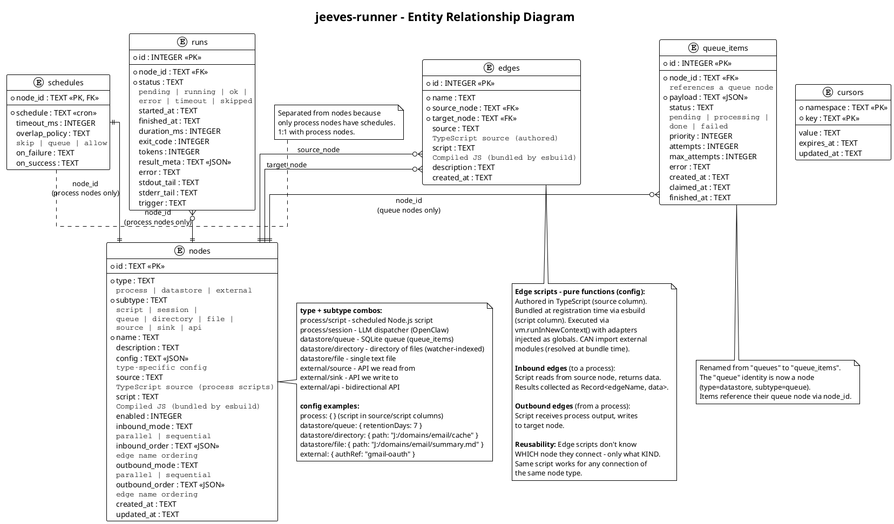
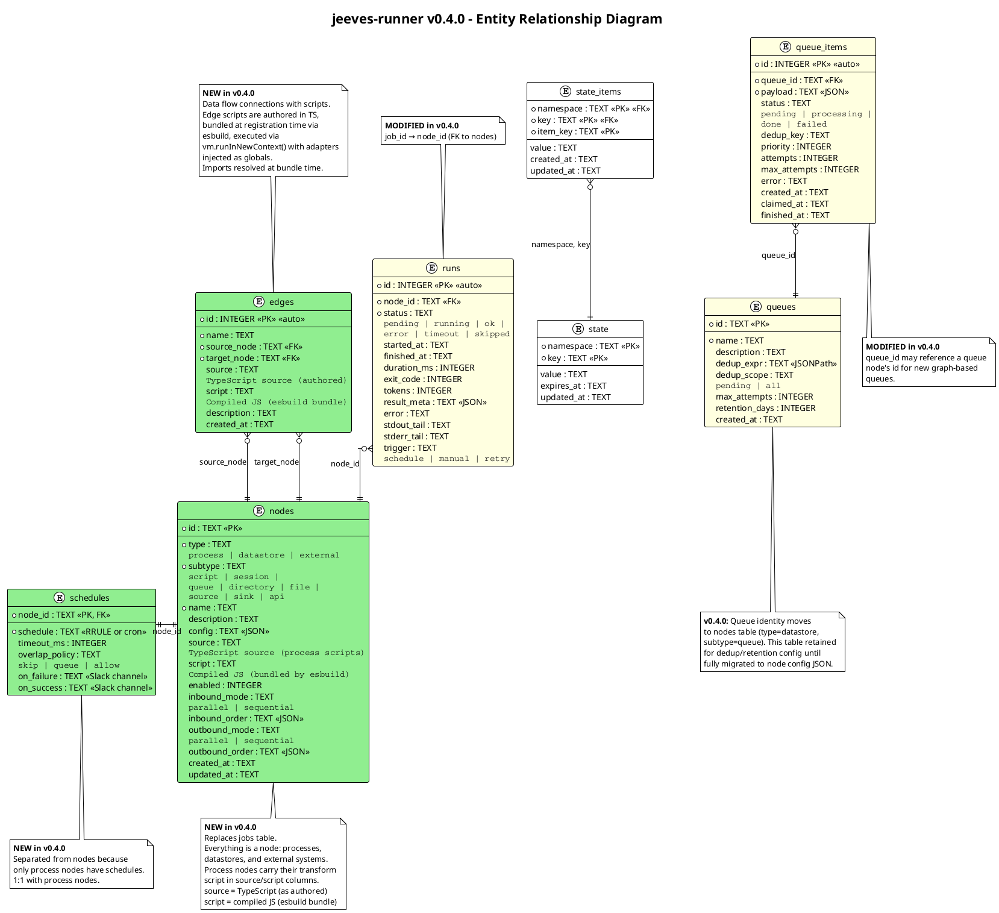

# jeeves-runner - Specification

**Current Version:** 0.3.1
**Next Version:** 0.4.0
**Date:** 2026-03-04
**Channel:** #project-jeeves-runner
**Production Reference:** [`production.md`](production.md) — current deployment config, jobs, scripts, data flow

---

## Spec Lifecycle

This spec follows a phased-locking discipline:

1. **Current Version** stays locked during Next Version design
2. **Next Version** stays locked during dev planning
3. **Dev Plan** stays locked during implementation
4. On green: archive spec as `spec-v{next}.md`, update Current Version to match reality, promote backlog items to Next Version

---

## 1. Overview

jeeves-runner is a job execution engine that replaces n8n and the Windows Task Scheduler as the substrate for the Global Synthesis Data Flow. It runs scheduled jobs, tracks their state in SQLite, and exposes status via an HTTP API.

---

## 2. Vision

### The Jeeves Platform

jeeves-runner is one component of a four-part product:

| Component | Role | Exists? |
|---|---|---|
| **jeeves-runner** | **Execute:** run processes, move data through the graph | This spec |
| **jeeves-watcher** | **Index:** observe file-backed datastores, embed in Qdrant | Shipped (v0.4.4) |
| **jeeves-server** | **Present:** UI, API, file serving, search, dashboards | Shipped |
| **Jeeves skill** | **Converse:** configure, operate, and query via chat | Not yet implemented |

The end-state: a user deploys a container, connects a messaging surface (Slack, Telegram, etc.), and starts talking to Jeeves. Jeeves configures the data flow graph, writes glue code, and the runner executes it. The watcher indexes file outputs into Qdrant for semantic search. The server UI provides transparency into what Jeeves built and how jobs are performing.

### Domain Agnosticism

The runner is a **generic execution engine**. It is completely unaware of domain concepts like "projects," "meetings," or "email." It knows only graph primitives:

- **Source** - an external system that data comes from (Gmail, GitHub API, Slack API)
- **Sink** - an external system that data goes to (Notion, GitHub Pages, X)
- **Datastore** - a persistent store of artifacts (files on disk, or tables in SQLite)
- **Queue** - an ordered buffer between processes (SQLite table with claim semantics)
- **Process** - a scheduled script that reads from inbound edges and writes to outbound edges
- **Auth** - credentials attached to sources and sinks

"Projects," "meetings," "Slack meta," etc. are all just instances of the above - graph configurations and glue code, not runner concepts. The runner treats them all the same.

### File vs. Table Datastores

The choice of backing store maps directly to the watcher relationship:

| If the datastore... | Then use... | Why |
|---|---|---|
| Produces artifacts for Qdrant embedding | **Files on disk** | Watcher observes and indexes them |
| Produces artifacts served by jeeves-server | **Files on disk** | Server renders and serves them |
| Stores operational state (cursors, seen-records) | **SQLite tables** | No need for indexing or serving |
| Stores queue items | **SQLite tables** | Transient, operational |
| Stores run history | **SQLite tables** | Operational, queried by dashboard |

### OpenClaw Plugin & Skill Architecture

Each Jeeves platform component exposes an **OpenClaw plugin** (tools) and one or more **skills** (instructions for using the tools). The plugin provides raw capabilities; the skill teaches the LLM how and when to use them.

**Per-component skills follow a use/manage split:**

| Component | Use Skill | Manage Skill |
|---|---|---|
| **jeeves-runner** | Query status, trigger runs, inspect history | Mutate graph, configure auth, write glue code |
| **jeeves-watcher** | Search indexed docs, check status | Configure watch sets, manage reindexing |
| **jeeves-server** | Generate links, browse datastores | Configure routes, manage auth |

**Example plugin tools for jeeves-runner:**

| Skill | Tool | Description |
|---|---|---|
| Use | `runner_status` | List jobs with current status |
| Use | `runner_history` | Get run history for a job |
| Use | `runner_trigger` | Manually trigger a job run |
| Manage | `runner_add_node` | Add a source/sink/datastore/queue/process to the graph |
| Manage | `runner_add_edge` | Connect two nodes |
| Manage | `runner_set_schedule` | Set or update a process schedule |
| Manage | `runner_set_auth` | Configure credentials for a source/sink |

**The Jeeves skill** sits above all component skills as an orchestrator:

```
Jeeves skill (orchestrator)
├── jeeves-runner       (use: query, trigger, status)
├── jeeves-runner-admin (manage: graph mutations, auth, code gen)
├── jeeves-watcher      (use: search, status)
├── jeeves-watcher-admin (manage: config, reindex)
├── jeeves-server       (use: links, browse)
└── jeeves-server-admin (manage: config)
```

The runner's HTTP API is designed with this eventual skill/tool surface in mind. The actual plugin and skills are not yet implemented.

---

## 3. Current Version: 0.3.1

### Architecture

#### Stack

| Component | Technology | Notes |
|-----------|-----------|-------|
| Runtime | Node.js (v24+) | Uses built-in `node:sqlite` module |
| Scheduler | `croner` v10 | Lightweight cron expression parser/scheduler |
| Database | SQLite (via `node:sqlite`) | Job definitions, run history, state, queues. `node:sqlite` is synchronous; `better-sqlite3` is a drop-in fallback if the API changes. |
| Process isolation | `child_process.spawn` | Each job runs in its own process |
| HTTP framework | Fastify v5 | Lightweight API server |
| CLI | `commander` v14 | CLI argument parsing |
| Schemas | `zod` v4 | Runtime validation, TypeScript type inference |
| Logging | `pino` v10 | Structured JSON logging |
| Queue dedup | `jsonpath-plus` v10 | JSONPath expression evaluation for dedup keys |
| Service management | NSSM | Windows service, same as qdrant/watcher |

#### Design Principles

- **Domain Agnosticism:** The runner has no knowledge of what jobs do. It schedules processes, captures their output, and tracks state. The domain logic lives entirely in the job scripts.
- **No New Infrastructure:** No Redis, no external database, no new services beyond the runner itself. SQLite file lives alongside the runner.

#### Directory Structure

**Runner monorepo** (two packages: `packages/service` + `packages/openclaw`):
```
jeeves-runner/                          # D:\repos\karmaniverous\jeeves-runner
├── package.json                        # Monorepo root (private, npm workspaces)
├── README.md
├── eslint.config.ts                    # Shared ESLint config
├── tsconfig.json                       # Root TypeScript config
├── stan.config.yml                     # STAN pipeline config
├── lefthook.yml                        # Git hooks
├── typedoc.json                        # API docs config
├── docs/                               # Generated TypeDoc output
├── packages/
│   ├── service/                        # @karmaniverous/jeeves-runner (the engine)
│   │   ├── package.json
│   │   ├── rollup.config.ts
│   │   ├── CHANGELOG.md
│   │   ├── assets/                     # Architecture diagrams (PNG)
│   │   ├── diagrams/                   # PlantUML diagram sources
│   │   ├── guides/                     # Markdown guides (getting-started, api-reference, etc.)
│   │   ├── scripts/
│   │   │   └── seed-jobs.ts            # Job seeding utility
│   │   └── src/
│   │       ├── index.ts                # Package exports
│   │       ├── runner.ts               # Entry point: load config, init DB, start scheduler + API
│   │       ├── runner.test.ts          # Runner integration tests
│   │       ├── api/
│   │       │   ├── routes.ts           # Fastify route definitions
│   │       │   ├── routes.test.ts
│   │       │   └── server.ts           # Fastify server setup
│   │       ├── cli/
│   │       │   └── jeeves-runner/
│   │       │       ├── index.ts        # CLI entry: `jeeves-runner start --config <path>`
│   │       │       ├── index.test.ts
│   │       │       └── commands/
│   │       │           ├── config.ts   # `jeeves-runner config validate|show|init`
│   │       │           └── service.ts  # `jeeves-runner service install|uninstall`
│   │       ├── client/
│   │       │   ├── client.ts           # createClient(dbPath) — helper library for jobs
│   │       │   ├── client.test.ts
│   │       │   ├── queue-ops.ts        # Queue operations (enqueue, dequeue, done, fail)
│   │       │   ├── state-ops.ts        # State operations (scalar + collection)
│   │       │   └── state-ops.test.ts
│   │       ├── db/
│   │       │   ├── connection.ts       # SQLite connection management
│   │       │   ├── maintenance.ts      # Run retention, state cleanup
│   │       │   ├── maintenance.test.ts
│   │       │   ├── migrations.ts       # Schema migrations (001-003)
│   │       │   ├── migrations.test.ts
│   │       │   └── migrations/
│   │       │       └── 001-initial.sql
│   │       ├── gateway/
│   │       │   ├── client.ts           # Gateway API client (native session dispatch)
│   │       │   └── client.test.ts
│   │       ├── lib/
│   │       │   └── http.ts            # Shared HTTP POST utility
│   │       ├── notify/
│   │       │   ├── slack.ts           # Slack notification sender
│   │       │   └── slack.test.ts
│   │       ├── scheduler/
│   │       │   ├── scheduler.ts       # Croner wrapper, job lifecycle
│   │       │   ├── scheduler.test.ts
│   │       │   ├── executor.ts        # Spawn jobs, capture output, update runs
│   │       │   ├── executor.test.ts
│   │       │   ├── session-executor.ts     # Native session dispatch (Gateway API)
│   │       │   ├── session-executor.test.ts
│   │       │   ├── run-repository.ts  # Run record SQL
│   │       │   ├── cron-registry.ts   # Cron instance management
│   │       │   └── notification-helper.ts
│   │       ├── schemas/
│   │       │   ├── config.ts          # Config file schema (Zod)
│   │       │   ├── job.ts             # Job schema
│   │       │   ├── queue.ts           # Queue schema
│   │       │   └── run.ts             # Run schema
│   │       ├── test-utils/
│   │       │   └── db.ts             # Shared test DB setup
│   │       └── types/
│   │           └── node-sqlite.d.ts
│   └── openclaw/                       # @karmaniverous/jeeves-runner-openclaw (plugin)
│       ├── package.json
│       ├── openclaw.plugin.json        # Plugin manifest
│       ├── rollup.config.ts
│       ├── guides/
│       │   ├── index.md
│       │   └── openclaw-integration.md
│       ├── skills/
│       │   └── jeeves-runner/
│       │       └── SKILL.md            # Consumer skill (ships with plugin)
│       └── src/
│           ├── index.ts
│           ├── cli.ts                  # `npx @karmaniverous/jeeves-runner-openclaw install|uninstall`
│           ├── helpers.ts              # API URL resolution, HTTP helpers
│           ├── helpers.test.ts
│           ├── runnerTools.ts          # 7 tool implementations (HTTP wrappers)
│           └── runnerTools.test.ts
```

> **Local deployment config** (scripts, jobs, credentials, state) is documented in [`production.md`](production.md).

### SQLite Schema (v0.3.1)



#### `jobs` - Job Definitions

Replaces `cron-index.json` and n8n workflow configs.

```sql
CREATE TABLE IF NOT EXISTS jobs (
    id              TEXT PRIMARY KEY,
    name            TEXT NOT NULL,
    schedule        TEXT NOT NULL,
    script          TEXT NOT NULL,
    type            TEXT DEFAULT 'script',  -- 'script' | 'session'
    description     TEXT,
    enabled         INTEGER DEFAULT 1,
    timeout_ms      INTEGER,
    overlap_policy  TEXT DEFAULT 'skip',    -- 'skip' | 'allow' ('queue' accepted but not implemented)
    on_failure      TEXT,
    on_success      TEXT,
    created_at      TEXT DEFAULT (datetime('now')),
    updated_at      TEXT DEFAULT (datetime('now'))
);
```

**Note:** Session-type jobs are now stored with `type='script'` in the database. They still use the fire-and-forget spawn-worker.js pattern for backward compatibility with the existing dispatcher scripts, but the runner's native session executor is available for future jobs.

**Overlap policy:** Only `'skip'` and `'allow'` are valid. `'queue'` throws an error at registration time.

#### `runs` - Run History

```sql
CREATE TABLE IF NOT EXISTS runs (
    id              INTEGER PRIMARY KEY AUTOINCREMENT,
    job_id          TEXT NOT NULL REFERENCES jobs(id),
    status          TEXT NOT NULL,          -- 'pending' | 'running' | 'ok' | 'error' | 'timeout' | 'skipped'
    started_at      TEXT,
    finished_at     TEXT,
    duration_ms     INTEGER,
    exit_code       INTEGER,
    tokens          INTEGER,               -- LLM token count (session jobs only)
    result_meta     TEXT,                   -- JSON from JR_RESULT line
    error           TEXT,
    stdout_tail     TEXT,
    stderr_tail     TEXT,
    trigger         TEXT DEFAULT 'schedule' -- 'schedule' | 'manual' | 'retry'
);

CREATE INDEX IF NOT EXISTS idx_runs_job_started ON runs(job_id, started_at DESC);
CREATE INDEX IF NOT EXISTS idx_runs_status ON runs(status);
```

#### `queues` - Queue Identity & Behavior (v0.2.0)

Defines queue identity, deduplication strategy, and retention policy.

```sql
CREATE TABLE IF NOT EXISTS queues (
    id              TEXT PRIMARY KEY,
    name            TEXT NOT NULL,
    description     TEXT,
    dedup_expr      TEXT,                   -- JSONPath expression (jsonpath-plus) to extract dedup key
    dedup_scope     TEXT DEFAULT 'pending', -- 'pending' (only pending/processing) | 'all' (includes done)
    max_attempts    INTEGER DEFAULT 1,
    retention_days  INTEGER DEFAULT 7,
    created_at      TEXT DEFAULT (datetime('now'))
);
```

#### `queue_items` - Queue Items (v0.2.0)

Renamed from `queues` (v0.1.x). Items reference their queue via `queue_id` (FK).

```sql
CREATE TABLE IF NOT EXISTS queue_items (
    id              INTEGER PRIMARY KEY AUTOINCREMENT,
    queue_id        TEXT NOT NULL REFERENCES queues(id),
    payload         TEXT NOT NULL,          -- JSON blob
    status          TEXT DEFAULT 'pending', -- 'pending' | 'processing' | 'done' | 'failed'
    dedup_key       TEXT,                   -- Computed at enqueue time via queue's dedup_expr
    priority        INTEGER DEFAULT 0,
    attempts        INTEGER DEFAULT 0,
    max_attempts    INTEGER,                -- Overrides queue default if set
    error           TEXT,
    created_at      TEXT DEFAULT (datetime('now')),
    claimed_at      TEXT,
    finished_at     TEXT
);

CREATE INDEX IF NOT EXISTS idx_queue_items_poll ON queue_items(queue_id, status, priority DESC, created_at);
CREATE INDEX IF NOT EXISTS idx_queue_items_dedup ON queue_items(queue_id, dedup_key, status);
```

#### `state` - Scalar State (v0.2.0)

Renamed from `cursors` (v0.1.x). For scalar key-value pairs (lastRunAt, lastSeenId, config values).

```sql
CREATE TABLE IF NOT EXISTS state (
    namespace       TEXT NOT NULL,
    key             TEXT NOT NULL,
    value           TEXT,
    expires_at      TEXT,
    updated_at      TEXT DEFAULT (datetime('now')),
    PRIMARY KEY (namespace, key)
);

CREATE INDEX IF NOT EXISTS idx_state_expires ON state(expires_at) WHERE expires_at IS NOT NULL;
```

#### `state_items` - Collection State (v0.2.0)

For unbounded collections (seenThreadIds, processedThreads). One row per member, FK to `state(namespace, key)`.

```sql
CREATE TABLE IF NOT EXISTS state_items (
    namespace       TEXT NOT NULL,
    key             TEXT NOT NULL,
    item_key        TEXT NOT NULL,
    value           TEXT,
    created_at      TEXT DEFAULT (datetime('now')),
    updated_at      TEXT DEFAULT (datetime('now')),
    PRIMARY KEY (namespace, key, item_key),
    FOREIGN KEY (namespace, key) REFERENCES state(namespace, key)
);

CREATE INDEX IF NOT EXISTS idx_state_items_ns_key ON state_items(namespace, key);
```

### Client API (v0.3.1)

The client library provides operations for queues and state (scalar + collection).

```typescript
// Queue operations
enqueue(queueId: string, payload: object, options?: { priority?: number; maxAttempts?: number }): number  // returns item ID, or -1 if dedup skipped
dequeue(queueId: string, limit: number): Array<{ id: number, payload: object }>
done(itemId: number): void
fail(itemId: number, error: string): void

// Scalar state
getState(namespace: string, key: string): string | null
setState(namespace: string, key: string, value: string, options?: { ttl?: number }): void
deleteState(namespace: string, key: string): void

// Collection state
hasItem(namespace: string, key: string, itemKey: string): boolean
getItem(namespace: string, key: string, itemKey: string): string | null
setItem(namespace: string, key: string, itemKey: string, value?: string): void
deleteItem(namespace: string, key: string, itemKey: string): void
countItems(namespace: string, key: string): number
pruneItems(namespace: string, key: string, keepCount: number): number  // delete oldest, keep newest N by updated_at
listItemKeys(namespace: string, key: string, options?: { limit?: number; order?: 'asc' | 'desc' }): string[]
```

**Usage:**

```js
const jr = createClient('J:/state/runner/runner.sqlite');
// Or use JR_DB_PATH env var (set automatically by runner when spawning jobs):
// const jr = createClient(process.env.JR_DB_PATH);

// Queue operations
jr.enqueue('email-updates', { threadId: 'abc123', action: 'label', labels: ['meeting'] });
const items = jr.dequeue('email-updates', 10);  // claims up to 10
jr.done(items[0].id);
jr.fail(items[1].id, 'API error');

// Scalar state
const lastRun = jr.getState('email', 'jason@johngalt.id.updatedAt');
jr.setState('email', 'jason@johngalt.id.updatedAt', Date.now().toString());

// Collection state
if (!jr.hasItem('email', 'jason@johngalt.id.seenThreadIds', threadId)) {
  jr.setItem('email', 'jason@johngalt.id.seenThreadIds', threadId);
}
const seenCount = jr.countItems('email', 'jason@johngalt.id.seenThreadIds');
jr.pruneItems('email', 'jason@johngalt.id.seenThreadIds', 5000);  // keep newest 5000, delete rest
const recentThreads = jr.listItemKeys('email', 'jason@johngalt.id.seenThreadIds', { limit: 100 });
```

### Runner Lifecycle

#### Startup

1. Open/create SQLite database, run migrations (001, 002, 003)
2. Load config from `--config` path
3. Seed jobs from `schedule.json` (upsert - preserves enabled state on restart)
4. Validate schedules with croner (#5); notify on failures (#4)
5. Schedule each enabled job with `croner`
6. Start runtime schedule reconciliation loop (#6)
7. Start Fastify HTTP API on configured port
8. Log: "jeeves-runner started, N jobs scheduled"

#### Job Execution

```
Schedule fires
  → Re-read job row from DB (captures script/config changes without restart)
  → If job disabled or deleted: skip silently
  → Check overlap_policy (skip if running and policy = 'skip')
  → INSERT INTO runs (status = 'running')
  → If type='script': spawn('node', [script], { env: { JR_DB_PATH, JR_JOB_ID, JR_RUN_ID } })
  → If type='session': call Gateway API (native session dispatch)
  → Capture stdout/stderr (ring buffer, last 100 lines)
  → Parse stdout for JR_RESULT:{json} lines → extract tokens + result_meta
  → On timeout: kill process, UPDATE runs (status = 'timeout'), notify
  → On exit 0: UPDATE runs (status = 'ok', ...), notify if on_success
  → On exit non-0: UPDATE runs (status = 'error', ...), notify if on_failure
```

> **Note (v0.2.0):** The cron callback captures only the `job.id` at startup, then re-reads the full job row from SQLite on each fire. This means DB changes (script path, enabled state, timeout, etc.) take effect without restarting the runner.

#### Notifications

- **on_failure** (per-job, defaults to `D0AB0NJ96H3`): `⚠️ *{job.name}* failed ({duration}s): {error_summary}`
- **on_success** (per-job, defaults to null/silent): `✅ *{job.name}* completed ({duration}s)`
- Slack bot token path configured via `notifications.slackTokenPath`

#### Concurrency

Max N concurrent jobs (configurable, default 4). If limit is hit:
- `skip` → mark run as 'skipped'
- `allow` → run anyway (ignores global limit)

**Note:** `overlap_policy='queue'` is accepted by the schema but not implemented; only `'skip'` and `'allow'` have defined behavior (Decision 9).

#### Shutdown

On SIGTERM/SIGINT: stop scheduling, wait for running jobs (grace period 30s), then exit.

### HTTP API

Fastify v5 server on `localhost:1937` (default).

> **Why 1937?** Jeeves services use ports in the 1930s decade, a nod to the era of P.G. Wodehouse's Jeeves stories. 1937 is the publication year of *The Code of the Woosters*, widely considered the finest Jeeves novel. Port assignments: jeeves-server (1934), jeeves-watcher (1936), jeeves-runner (1937).

| Method | Path | Description | Status |
|--------|------|-------------|--------|
| `GET` | `/health` | Health check | ✅ |
| `GET` | `/jobs` | List all jobs with last run status | ✅ |
| `GET` | `/jobs/:id` | Single job detail | ✅ |
| `GET` | `/jobs/:id/runs` | Run history (limit param) | ✅ |
| `POST` | `/jobs/:id/run` | Trigger manual run | ✅ |
| `POST` | `/jobs/:id/enable` | Enable a job | ✅ |
| `POST` | `/jobs/:id/disable` | Disable a job | ✅ |
| `GET` | `/stats` | Aggregate stats | ✅ |

### Configuration

Configuration is defined via a JSON file passed to `--config`. See `config.ts` for the Zod schema.

Key fields: `port` (default 1937), `dbPath`, `maxConcurrency` (default 4), `runRetentionDays`, `gateway.url`, `gateway.tokenPath`, `notifications.slackTokenPath`, `notifications.defaultOnFailure`, `log.level`, `log.file`.

> **Local config values:** See [`production.md`](production.md).

### Design Decisions

| # | Question | Decision |
|---|---|---|
| 1 | Repo structure | Monorepo with two packages (`packages/service` + `packages/openclaw`), npm workspaces, independent versioning. TypeScript. |
| 2 | Notification channel | Slack only for now. |
| 3 | Dashboard location | New route on jeeves-server (consolidated UI). |
| 4 | Initial job setup | Seed from `schedule.json` on startup (upsert). |
| 5 | Service account | NSSM runs as `.\Administrator` (required for gog OAuth token access via DPAPI keyring). |
| 6 | Session job dispatch | Runner engine supports native session dispatch via Gateway API (`session-executor.ts`). Current local deployment still uses script-type dispatchers that spawn their own sessions; migration to native dispatch planned for v0.4.0 graph architecture. |
| 7 | State storage model | Two tables: `state` for scalars, `state_items` for unbounded collections with FK to `state(namespace, key)`. Every collection has a parent row. Email `seenThreadIds` (1,381+ entries, 316KB+ as JSON) cannot live in a single TEXT field. Collection members are individual rows with indexed lookups. |
| 8 | Cursor aliases removed (v0.3.0) | `getCursor`/`setCursor`/`deleteCursor` aliases removed. All consuming scripts migrated to `getState`/`setState`/`deleteState`. `createClient(dbPath)` now requires explicit DB path argument (or `JR_DB_PATH` env var). |
| 9 | `overlap_policy='queue'` not implemented | Zod schema accepts `'queue'` for forward compatibility, but `cron-registry.ts` narrows the type to `'skip' | 'allow'`. In practice, `'queue'` would be treated as `'allow'`. Only `'skip'` and `'allow'` have defined behavior. |
| 10 | Fastify v5 uses `loggerConfig` object | Not `loggerInstance`. Adapter pattern for Fastify v5 compatibility. |
| 11 | node:sqlite `DatabaseSync` does NOT support `UPDATE...RETURNING` |
| 12 | `busy_timeout = 5000` for concurrent child processes | Multiple runner child processes share the same SQLite file. Without busy_timeout, concurrent writes throw SQLITE_BUSY immediately. 5s timeout lets writers wait for lock release. WAL mode + busy_timeout together handle the multi-process model. Long-term fix in v0.4.0: runner becomes the sole writer. | Use transactions with separate SELECT after UPDATE. |

### Implementation Status (v0.3.1)

All v0.3.1 features are ✅ **completed and deployed**.

| Item | Status | Notes |
|------|--------|-------|
| Runner engine (scheduler, executor, DB) | ✅ Complete | v0.3.1 published |
| Scheduler hardening (#4, #5, #6) | ✅ Complete | Schedule validation, registration failure notifications, runtime reconciliation |
| `queues` table + dedup logic | ✅ Complete | Migration 002, jsonpath-plus dedup, retention pruning |
| State tables (`state` + `state_items`) | ✅ Complete | Migration 003, renamed from `cursors` |
| State client API (scalar + collection) | ✅ Complete | getState/setState/deleteState, hasItem/getItem/setItem/deleteItem/countItems/pruneItems/listItemKeys |
| Native session dispatch (Gateway client) | ✅ Complete | Gateway API client, session executor, 12 dispatcher scripts eliminated |
| CLI (`jeeves-runner start --config`) | ✅ Complete | |
| SQLite schema (jobs, runs, queues, queue_items, state, state_items) | ✅ Complete | Migrations 001, 002, 003 applied |
| HTTP API (health, jobs, runs, enable/disable, trigger, stats) | ✅ Complete | Port 1937 |
| Slack failure notifications | ✅ Complete | Via `notify/slack.ts` |
| Job seeding from `schedule.json` | ✅ Complete | 27 jobs seeded |
| Monorepo restructure (packages/service + packages/openclaw) | ✅ Complete | v0.3.0 |
| OpenClaw plugin (7 HTTP wrapper tools) | ✅ Complete | v0.1.0 published |
| Consumer skill (shipped in plugin) | ✅ Complete | v0.3.0 |
| Cursor aliases removed from client API | ✅ Complete | v0.3.0 |
| Consuming scripts migrated (getCursor→getState) | ✅ Complete | 15 scripts, Phase 4 |
| Default port 1937 | ✅ Complete | Schema + prod config |
| Code review | ✅ Complete | 92 tests passing (83 service + 9 plugin) |
| SQLite busy_timeout fix | ✅ Complete | v0.3.1 — PR #25 merged, — prevents SQLITE_BUSY on concurrent writes |

> **Job inventory and schedules:** See [`production.md`](production.md).

---

## 4. Completed: 0.3.0 — Monorepo & OpenClaw Plugin

This version restructures jeeves-runner from a single npm package into a monorepo with two packages: the execution engine (service) and an OpenClaw plugin. The plugin ships operational skills and (eventually) admin tools to any OpenClaw-powered assistant running jeeves-runner.

### Motivation

- **Operational knowledge is trapped locally.** The `jeeves-runner-dev` skill at `J:\jeeves\skills\` contains consumer-facing operational knowledge (API reference, troubleshooting, job management patterns) that should ship with the package, not live in a single Jeeves installation.
- **Plugin SDK enables tooling.** OpenClaw plugins can register tools and skills. A jeeves-runner plugin can expose runner status, job management, and eventually graph mutation tools directly to the assistant.
- **Monorepo pattern proven.** jeeves-watcher successfully uses `packages/service` + `packages/openclaw` with npm workspaces, shared root tooling, and per-package release-it. Adopting the same pattern keeps the ecosystem consistent.

### Target Structure

```
jeeves-runner/                          # monorepo root
├── packages/
│   ├── service/                        # @karmaniverous/jeeves-runner
│   │   ├── src/                        # current source (moved from root)
│   │   ├── package.json                # bin, deps, build, test, release
│   │   ├── rollup.config.ts
│   │   ├── tsconfig.json
│   │   ├── vitest.config.ts
│   │   └── knip.json
│   └── openclaw/                       # @karmaniverous/jeeves-runner-openclaw
│       ├── src/
│       │   ├── index.ts                # plugin entry
│       │   ├── cli.ts                  # install/uninstall CLI
│       │   └── runnerTools.ts          # tool implementations
│       ├── skills/
│       │   └── jeeves-runner/
│       │       └── SKILL.md            # consumer-facing operational skill
│       ├── openclaw.plugin.json        # plugin manifest
│       ├── package.json                # files, build, release
│       ├── rollup.config.ts            # builds plugin + CLI + copies skills
│       ├── knip.json
│       └── tsconfig.json
├── package.json                        # workspaces: ["packages/*"]
├── docs/                               # typedoc output (root)
├── eslint.config.ts                    # shared lint config
├── tsconfig.json                       # shared TS base
├── typedoc.json                        # shared docs config
├── lefthook.yml                        # shared git hooks
├── stan.config.yml
└── .prettierrc.json
```

### Package Details

**`@karmaniverous/jeeves-runner`** (service)
- The execution engine - everything in the current package
- CLI (`jeeves-runner start`, `jeeves-runner add-job`, etc.)
- SQLite schema + migrations
- Scheduler, executor, session executor, API server
- Client library (`createClient()` for process scripts)
- Independent versioning and release cycle

**`@karmaniverous/jeeves-runner-openclaw`** (plugin)
- OpenClaw plugin manifest (`openclaw.plugin.json`)
- Consumer-facing skill (operational knowledge, API reference, troubleshooting)
- Install/uninstall CLI (`npx @karmaniverous/jeeves-runner-openclaw install`) — bypasses broken OpenClaw `plugins install` (openclaw/openclaw#9224)
- Registered tools for runner operations (see Plugin Tools below)
- Independent versioning; references service package version compatibility in README

### Plugin Manifest

```json
{
  "id": "jeeves-runner-openclaw",
  "name": "Jeeves Runner",
  "description": "Job execution engine management - status, troubleshooting, and operational tools for jeeves-runner.",
  "version": "0.1.0",
  "skills": ["dist/skills/jeeves-runner"],
  "configSchema": {
    "type": "object",
    "additionalProperties": false,
    "properties": {
      "apiUrl": {
        "type": "string",
        "description": "jeeves-runner API base URL",
        "default": "http://127.0.0.1:1937"
      }
    }
  },
  "uiHints": {
    "apiUrl": {
      "label": "Runner API URL",
      "placeholder": "http://127.0.0.1:1937"
    }
  }
}
```

### Plugin Tools

The plugin registers tools for operating the runner service via its HTTP API. All tools call the runner API at `apiUrl` from plugin config.

| Tool | Description | Runner API Endpoint |
|------|-------------|---------------------|
| `runner_status` | Service health check — uptime, job counts, running jobs, failed registrations | `GET /stats` |
| `runner_jobs` | List all jobs with status, schedule, last run, next run | `GET /jobs` |
| `runner_trigger` | Manually trigger a job by ID, returns run result | `POST /jobs/:id/run` |
| `runner_runs` | Recent run history for a job — status, duration, exit code, error | `GET /jobs/:id/runs` |
| `runner_job_detail` | Full job config — schedule, script, overlap policy, notifications | `GET /jobs/:id` |
| `runner_enable` | Enable a disabled job | `POST /jobs/:id/enable` |
| `runner_disable` | Disable a job (stops future scheduled runs) | `POST /jobs/:id/disable` |

Tool implementations are thin HTTP wrappers: validate input → call runner API → format response for the assistant. No direct DB access from the plugin.

### Skill Content

The consumer-facing skill (`packages/openclaw/skills/jeeves-runner/SKILL.md`) ships the operational knowledge from Part 1 of the current local dev skill:

- Architecture overview (service, config, database, API)
- HTTP API reference with examples
- SQLite direct access patterns
- Service management commands
- Job types and design principles
- Troubleshooting guide
- Engineering standards for process scripts

Skills are static markdown files copied into `dist/skills/` via `rollup-plugin-copy` in the rollup build config. No separate build-skills script needed. (This supersedes the `build-skills.ts` pattern in jeeves-watcher; both repos should adopt the rollup approach.)

The local dev skill (`J:\jeeves\skills\jeeves-runner-dev\SKILL.md`) retains only Part 2 (development meta: repo location, dev workflow, release gates). Part 1 content is removed to avoid drift.

### Shared Root Tooling

Following the jeeves-watcher pattern:

| Concern | Root | Per-package |
|---------|------|-------------|
| ESLint | `eslint.config.ts` (shared rules) | - |
| Prettier | `.prettierrc.json` | - |
| TypeScript | `tsconfig.json` (base) | `tsconfig.json` (extends root) |
| Git hooks | `lefthook.yml` (branch naming, issue linking) | - |
| Build | - | `rollup.config.ts` per package |
| Test | - | `vitest.config.ts` (service only) |
| Release | - | `release-it` per package |
| STAN | `stan.config.yml` (root) | - |
| Knip | - | `knip.json` per package |
| Docs | `typedoc.json` (root), `docs/` (root) | `tsdoc.json` per package |

### Migration Steps

1. Create `packages/service/` and `packages/openclaw/` directories
2. Move all current source, config, and test files into `packages/service/`
3. Create root `package.json` with `workspaces: ["packages/*"]`
4. Hoist shared devDependencies to root (eslint, prettier, typescript, lefthook)
5. Update `tsconfig.json` references (root base, per-package extends)
6. Move rollup, vitest, knip configs into `packages/service/`
7. Create `packages/openclaw/` scaffold (manifest, package.json, skill, src/)
8. Extract Part 1 from local dev skill → `packages/openclaw/skills/jeeves-runner/SKILL.md`
9. Update local dev skill to Part 2 only
10. Verify: `npm run build`, `npm test`, `npm run lint`, `npm run typecheck` from root
11. Update CI/CD if applicable
12. Publish both packages

### Design Decisions

| # | Decision | Rationale |
|---|----------|-----------|
| 1 | Follow jeeves-watcher monorepo pattern exactly | Ecosystem consistency; proven tooling setup |
| 2 | Independent versioning per package | Plugin can iterate faster than engine; semver independence |
| 3 | Consumer skill ships in plugin, not service | Skills are an OpenClaw concept; the service package should remain OpenClaw-agnostic |
| 4 | Plugin tools wrap HTTP API | 7 tools (`runner_status`, `runner_jobs`, `runner_trigger`, `runner_runs`, `runner_job_detail`, `runner_enable`, `runner_disable`) — thin HTTP wrappers over the runner API. No direct DB access from the plugin. |
| 5 | Root-level STAN config | STAN runs at monorepo level; steps target workspace packages |
| 6 | Eliminate cursor backward-compat | Remove `getCursor`/`setCursor`/`deleteCursor` aliases from client API and `StateOps` interface. Refactor all consuming scripts to `getState`/`setState`/`deleteState`. The `cursors` table was renamed to `state` in v0.2.0 with backward-compat aliases; v0.3.0 completes the migration. |
| 7 | Default port already 1937 | Schema default is already `1937` (in `config.ts`). Prod config explicitly sets `3100` — update to `1937` at deployment time. No code change needed. |
| 8 | Table already renamed | Migration 003 already renames `cursors` → `state`. No additional migration needed; only the client API aliases need removal. |
| 9 | Skills via rollup, not build-skills | Static markdown skills copied into `dist/skills/` via `rollup-plugin-copy` in the rollup build. No separate `build-skills.ts` script. Apply to both runner and watcher repos. |
| 10 | Root package is private | Root monorepo `package.json` is `"private": true` — standard npm monorepo convention to prevent accidental publish of the workspace container. |
| 11 | Install/uninstall CLI | Plugin ships a CLI binary (`npx @karmaniverous/jeeves-runner-openclaw install/uninstall`) that bypasses OpenClaw's broken `plugins install` (openclaw/openclaw#9224). Follows watcher pattern exactly. |
| 12 | Docs at repo root | `typedoc.json` and `docs/` output live at the monorepo root, not inside `packages/service/`. |

### Implementation Status (v0.3.0)

| Item | Status | Notes |
|------|--------|-------|
| Monorepo restructure (packages/service + packages/openclaw) | ✅ Done | Phase 1 |
| Root workspace config (eslint, prettier, typescript, lefthook) | ✅ Done | Hoisted shared devDeps, root configs |
| Plugin scaffold (manifest, CLI, tools, rollup) | ✅ Done | Phase 3 |
| Plugin tools (7 HTTP wrappers) | ✅ Done | Phase 3 |
| Consumer skill extraction (Part 1 → plugin, Part 2 stays local) | ✅ Done | Phase 3 |
| Cursor alias removal (client API) | ✅ Done | Phase 2 |
| Cursor alias removal (consuming scripts — local deployment) | ✅ Done | Phase 4 — migrated 15 scripts, replaced shim with junction symlinks |
| Port 3100 → 1937 (schema default) | ✅ Done | Prod config update is Phase 4 |
| release-it config per package | ✅ Done | Matches watcher pattern |
| Docs at root | ✅ Done | PR #22 — guides, diagrams, typedoc config |
| CLI: service install/uninstall | ✅ Done | Prints platform instructions |
| CLI: validate, init, config-show | ✅ Done | Config management commands |

**PR:** [#21](https://github.com/karmaniverous/jeeves-runner/pull/21) (Phases 1–3, open, STAN 7/7, 118 tests)

---

## Dev Plan (v0.3.0) — Completed

### Phase 1: Monorepo Restructure

Reorganize the repo from single package to npm workspaces. No functional changes; all tests must still pass.

**Step 1.1: Create workspace structure**
- Create `packages/service/` and `packages/openclaw/` directories
- Move all current source, config, and test files into `packages/service/`
  - `src/`, `scripts/`, `assets/`, `diagrams/`, `docs/`
  - `rollup.config.ts`, `vitest.config.ts`, `knip.json`, `tsdoc.json`, `typedoc.json`
  - `tsconfig.json` (becomes per-package, extends root)
  - `.env.local.template`
- Move `CHANGELOG.md` into `packages/service/` (per-package changelogs)
- Create root `package.json`: `"name": "jeeves-runner-monorepo", "private": true, "workspaces": ["packages/*"]`
- Root scripts: `build`, `lint`, `lint:fix`, `test`, `typecheck`, `knip`, `docs` (delegate to workspaces)
- *Branch:* `feature/monorepo-structure`

**Step 1.2: Hoist shared devDependencies**
- Move to root `package.json`: eslint, prettier, typescript, typescript-eslint, eslint-config-prettier, eslint-plugin-prettier, eslint-plugin-simple-import-sort, eslint-plugin-tsdoc, lefthook, rimraf, tsx, knip
- Keep in `packages/service/`: rollup plugins, vitest, typedoc, release-it, auto-changelog, cross-env, dotenvx, fs-extra, happy-dom
- Root: `eslint.config.ts`, `.prettierrc.json`, `lefthook.yml`, `stan.config.yml`, `tsconfig.json` (base)
- `packages/service/tsconfig.json` extends `../../tsconfig.json`
- *Same branch*

**Step 1.3: Verify green**
- `npm install` from root
- `npm run build` — service builds cleanly
- `npm test` — 112 tests pass
- `npm run lint` — clean
- `npm run typecheck` — clean
- `npm run knip` — clean (update knip config if workspace paths changed)
- *Same branch*

**PR → merge to `next` → dev test**

---

### Phase 2: Cursor Cleanup

Breaking change to the client API. Table rename and port change are already done.

**Validated findings:**
- Migration 003 already renames `cursors` → `state` table. No migration 004 needed.
- `config.ts` already defaults port to `1937`. Prod config (`jeeves-runner.config.json`) explicitly sets `3100` — update at deployment time (Phase 4).
- `state-ops.ts` SQL already references `state` table (not `cursors`).
- Only the client API still exports cursor aliases.

**Step 2.1: Remove cursor aliases from client API**
- In `state-ops.ts`: remove `getCursor`, `setCursor`, `deleteCursor` from `StateOps` interface and `createStateOps` implementation
- In `client.ts`: remove `getCursor`, `setCursor`, `deleteCursor` from `RunnerClient` interface
- Update all internal references (tests, etc.) to use `getState`/`setState`/`deleteState`
- Run tests — all must pass
- *Branch:* `feature/state-cleanup`

**PR → merge to `next` → dev test**

---

### Phase 3: OpenClaw Plugin

Create the plugin package with skill, tools, and install CLI.

**Step 3.1: Plugin scaffold**
- Create `packages/openclaw/package.json`:
  - `"name": "@karmaniverous/jeeves-runner-openclaw"`
  - `"version": "0.1.0"`
  - `"bin": { "jeeves-runner-openclaw": "./dist/cli.js" }` (install/uninstall CLI)
  - `"openclaw": { "extensions": ["./dist/index.js"] }`
  - `"files": ["dist", "openclaw.plugin.json"]`
  - release-it config with `tagName: "openclaw/${version}"`, hooks matching watcher pattern
  - devDeps: rollup, rollup-plugin-copy, typescript, auto-changelog, release-it, cross-env, dotenvx, knip
- Create `packages/openclaw/openclaw.plugin.json` (manifest with `uiHints`, see §4 Plugin Manifest)
- Create `packages/openclaw/tsconfig.json` (extends root)
- Create `packages/openclaw/knip.json`
- Create `packages/openclaw/rollup.config.ts`:
  - Plugin entry (`src/index.ts`) → `dist/index.js`
  - CLI entry (`src/cli.ts`) → `dist/cli.js` (with `#!/usr/bin/env node` banner)
  - `rollup-plugin-copy` to copy `skills/` → `dist/skills/` (replaces `build-skills.ts` pattern)
- *Branch:* `feature/openclaw-plugin`

**Step 3.2: Install/uninstall CLI**
- Create `packages/openclaw/src/cli.ts` following watcher pattern exactly:
  - `npx @karmaniverous/jeeves-runner-openclaw install` — copies package to `~/.openclaw/extensions/jeeves-runner-openclaw/`, patches `openclaw.json` (plugins.allow, plugins.entries, tools.allow)
  - `npx @karmaniverous/jeeves-runner-openclaw uninstall` — removes extension dir, patches config
  - Supports `OPENCLAW_CONFIG` and `OPENCLAW_HOME` env vars
- *Same branch*

**Step 3.3: Plugin tools**
- Create `packages/openclaw/src/runnerTools.ts` — 7 tools wrapping the runner HTTP API:

| Tool | Endpoint | Input | Output |
|------|----------|-------|--------|
| `runner_status` | `GET /stats` | none | uptime, job counts, running jobs |
| `runner_jobs` | `GET /jobs` | none | all jobs with status, schedule, last/next run |
| `runner_trigger` | `POST /jobs/:id/run` | `jobId` | run result (status, duration, exit code) |
| `runner_runs` | `GET /jobs/:id/runs` | `jobId`, optional `limit` | recent runs |
| `runner_job_detail` | `GET /jobs/:id` | `jobId` | full job config |
| `runner_enable` | `POST /jobs/:id/enable` | `jobId` | confirmation |
| `runner_disable` | `POST /jobs/:id/disable` | `jobId` | confirmation |

- Create `packages/openclaw/src/index.ts` — plugin entry, registers tools
- Tests for tool implementations (mocked HTTP responses)
- *Same branch*

**Step 3.4: Extract consumer skill**
- Extract Part 1 (operational knowledge) from `J:\jeeves\skills\jeeves-runner-dev\SKILL.md` → `packages/openclaw/skills/jeeves-runner/SKILL.md`
  - Architecture overview, HTTP API reference, SQLite patterns, service management, job types, troubleshooting, script engineering standards
  - Port references use 1937
- Trim local dev skill (`J:\jeeves\skills\jeeves-runner-dev\SKILL.md`) to Part 2 only (repo location, dev workflow, release gates)
- *Same branch*

**Step 3.5: Verify plugin build**
- `npm run build` from root — both packages build
- `npm run typecheck` — both packages clean
- `npm run lint` — clean
- `npm run test` — tool tests pass
- `npm pack` in `packages/openclaw/` — inspect tarball (dist/, openclaw.plugin.json, skill files present)
- *Same branch*

**PR → merge to `next` → dev test**

---

### Phase 4: Local Deployment & Script Migration

Not in the repo. Local changes to deploy v0.3.0.

**Step 4.1: Update consuming scripts**
- Search all files in `J:\config\processes\` and `J:\lib\` for `getCursor`/`setCursor`/`deleteCursor`
- Replace with `getState`/`setState`/`deleteState`
- No functional change (method signatures identical)
- Known scripts using cursor API (audit before deployment):
  - `J:\config\processes\poll.js` (email polling)
  - `J:\domains\x\queue\poll.js` (X polling)
  - `J:\domains\x\queue\process.js` (X processing)
  - Any other scripts calling `client.getCursor()` / `client.setCursor()`

**Step 4.2: Update prod config**
- Update `J:\config\jeeves-runner.config.json`: remove `"port": 3100` (defaults to 1937)
- Update any healthcheck/monitoring that polls port 3100 → 1937

**Step 4.3: Deploy**
- Stop prod runner
- `npm install -g @karmaniverous/jeeves-runner@0.3.0`
- Start runner (no new migration needed; table already renamed by 003)
- Verify all 28 jobs register, API responds on port 1937

**Step 4.4: Install plugin**
- `npm install -g @karmaniverous/jeeves-runner-openclaw@0.1.0`
- Register in OpenClaw gateway config
- Verify skill appears in available_skills

---

### Release Sequence

Two packages, single coordinated release. No alphas.

**Process:**
1. Merge phases 1–3 into `next` progressively, testing after each merge
2. After all three phases green: merge `next` → `main`
3. Cut releases: `@karmaniverous/jeeves-runner@0.3.0` first, then `@karmaniverous/jeeves-runner-openclaw@0.1.0`
4. Phase 4 (local deployment) follows release

| Phase | Branch | Gate |
|-------|--------|------|
| 1. Monorepo restructure | `feature/monorepo-structure` | PR review + all tests pass from workspace root |
| 2. Cursor cleanup | `feature/state-cleanup` | PR review + tests pass |
| 3. OpenClaw plugin | `feature/openclaw-plugin` | PR review + build + pack + tool tests |
| 4. Local deployment | N/A (scripts + config) | All jobs green on port 1937, plugin registered |

---

## 5. Next Version: 0.4.0 — Graph Architecture

This section describes the architectural leap from flat job scheduling to a graph-aware execution engine with edge-as-function semantics.

### Infrastructure vs. Config

A key design boundary:

- **Adapters are infrastructure.** They're TypeScript in the runner package, tested, versioned, released via the normal release cycle. Adding a new node type (e.g. `s3-bucket`) means writing an adapter and cutting a release.
- **Edge and process scripts are config.** They're TypeScript source stored in the SQLite DB, bundled at registration time via esbuild, and executed in a VM context. Adding a new data flow edge means writing a script and inserting a row. No release required.

The adapter library is the stable surface; scripts are the flexible layer on top. This is what makes the graph extensible without releases.

### Edge-as-Function Architecture

Edges become **executable functions** that move data between nodes. Each edge has a script that knows how to read from its source node type and write to its target node type.

#### Three-Phase Execution Model

When a process node executes, it follows a three-phase model (replacing the current direct script spawn):

```
1. COLLECT (inbound edges)
   For each inbound edge (parallel or sequential per process config):
     → Run edge script, which reads from the source node
     → Each script returns its collected data
     → Results assembled as: { [edgeName]: data, ... }

2. TRANSFORM (process script)
   → Process node's script receives the input object + ProcessContext
   → Performs domain-specific transformation
   → Produces an output object

3. DELIVER (outbound edges)
   For each outbound edge (parallel or sequential per process config):
     → Run edge script with the process output object
     → Each script writes to its target node
```

#### Edge Scripts as Pure Functions

Edge scripts interact with source and target nodes through **type-based adapter interfaces**, not specific node identities. An edge script doesn't know *which* queue or directory it's connected to - only that it's connected to *a* queue or *a* directory. This makes edge scripts **reusable**.

**Inbound edge script signature:**
```js
async function collect(source) {
  return source.dequeue(10);        // queue source
  return source.listNewFiles();     // directory source
}
```

**Outbound edge script signature:**
```js
async function deliver(output, target) {
  for (const item of output.items) {
    target.enqueue(item);           // queue target
  }
  for (const file of output.files) {
    target.writeFile(file.name, file.content);  // directory target
  }
}
```

**Execution mechanism:** Scripts are bundled at registration time via esbuild (see Script Engine below) and executed via `vm.runInNewContext()` with adapters injected as globals. Scripts *can* import external modules — imports are resolved and inlined at bundle time.

#### Node Type Adapters

Minimal wrappers that provide a type-specific interface to the underlying storage. No magic state tracking; scripts use cursors explicitly when needed.

| Node Subtype | Adapter Interface | Operations |
|---|---|---|
| `queue` | QueueAdapter | `enqueue()`, `dequeue()`, `peek()`, `done()`, `fail()` |
| `directory` | DirectoryAdapter | `listFiles()`, `readFile()`, `writeFile()` |
| `file` | FileAdapter | `read()`, `write()`, `append()` |
| `api` | ApiAdapter | `request()`, `get()`, `post()` |

DirectoryAdapter wraps a path with scoped `fs` operations. FileAdapter wraps a single file path. QueueAdapter wraps the SQLite queue client methods. ApiAdapter wraps HTTP calls with auth injection.

#### Parallel vs. Sequential Edge Execution

Controlled by properties on the process node:

```json
{
  "inbound_mode": "parallel",
  "inbound_order": null,
  "outbound_mode": "sequential",
  "outbound_order": ["write-cache", "enqueue-updates"]
}
```

- **`parallel`** (default): All edge scripts run concurrently via `Promise.all()`.
- **`sequential`**: Edge scripts run one at a time in the order specified by `inbound_order` / `outbound_order`.

### Script Engine

Scripts (edge and process) are authored in TypeScript, bundled at registration time, and executed in isolated VM contexts. This replaces the original `new Function()` approach and eliminates the "no imports" constraint.

#### Authoring & Storage

Scripts are stored in the DB with two columns:

- **`source`** — TypeScript source as authored. The source of truth for editing.
- **`script`** — Compiled, bundled JavaScript. The executable artifact.

Both edge scripts and process scripts use this dual-column model.

#### Bundling via esbuild

At registration time (when a script is created or updated), the runner compiles and bundles the source in memory using esbuild:

1. **Type stripping** — esbuild strips TypeScript types (`loader: 'ts'`).
2. **Import resolution** — bare imports (e.g. `import { z } from 'zod'`) resolve against: (a) the runner's own `node_modules` (ships with common deps), then (b) `additionalModulePaths` from config.
3. **Bundling** — resolved imports are inlined into a single self-contained module (`bundle: true`).
4. **No filesystem temp files** — source comes from the DB, esbuild resolves imports via its plugin API (`onResolve` hook), output goes back to the DB.

```typescript
const result = await esbuild.build({
  stdin: { contents: tsSource, loader: 'ts' },
  bundle: true,
  write: false,
  format: 'cjs',
  plugins: [{
    name: 'resolve-modules',
    setup(build) {
      build.onResolve({ filter: /^[^./]/ }, args => ({
        path: require.resolve(args.path, {
          paths: [runnerNodeModules, ...additionalModulePaths]
        })
      }));
    }
  }]
});
const bundledJs = result.outputFiles[0].text;
```

Bundling is sub-10ms for typical scripts. esbuild tree-shakes aggressively, so `import { groupBy } from 'lodash-es'` bundles ~1KB, not all of lodash.

#### Script Dependencies

The runner's own `package.json` includes commonly-needed libraries (lodash-es, date-fns, zod, etc.) available to all scripts. For additional dependencies, the config provides `additionalModulePaths` pointing to the state directory:

```json
{
  "additionalModulePaths": ["J:/state/runner"]
}
```

`J:\state\runner\` already holds the SQLite DB. It also holds a `package.json` + `node_modules` for script-specific dependencies. To add a new dependency, run `npm install <pkg>` in that directory. This is an operational task (managed by Jeeves), not a runner release.

Each bundled script is fully self-contained. If ten scripts import `lodash/groupBy`, each bundle includes its own copy. This is an acceptable tradeoff: esbuild tree-shakes to minimal size, DB storage is cheap, and the alternative (shared runtime modules with version management) is framework-level complexity that isn't warranted yet.

#### Execution

Compiled JS executes via `vm.runInNewContext()` with injected globals:

- **Edge scripts** receive adapter interfaces (`source`, `target`) as globals
- **Process scripts** receive a `ProcessContext` with state API, logger, config, and the collected input object

No runtime `require()`. All imports were resolved at bundle time. The VM context is not a security sandbox (we control the scripts); it provides clean scope isolation between script executions.

#### Typed Interfaces

The runner package exports `.d.ts` type definitions for all script-facing interfaces:

- `ProcessContext` — state API, logger, config access
- `CollectFn` — inbound edge script signature
- `DeliverFn` — outbound edge script signature
- `TransformFn` — process script signature
- `QueueAdapter`, `DirectoryAdapter`, `FileAdapter`, `ApiAdapter` — node type adapters

These provide full IntelliSense in any TypeScript-aware editor. When the v0.5.0 web UI ships Monaco Editor, these same type definitions drive in-browser autocomplete.

### Graph Data Model

The `jobs` table is replaced by a graph of `nodes` and `edges`. Everything - processes, datastores, and external systems - is a node. Edges represent data flow direction **and carry the scripts** that move data between nodes.



**Key design choices:**

1. **Everything is a node.** Processes, datastores, and externals all live in one `nodes` table with `type`/`subtype` discrimination.
2. **`schedules` is a separate table** (1:1 with process nodes). Only process nodes have schedules.
3. **`queue_items` references its queue node** via `node_id`. Creating a new queue = inserting a node with `type=datastore, subtype=queue`.
4. **`edges` carry data flow direction and scripts.** Each edge's script defines how data moves.
5. **`config` is a JSON column** for type-specific settings. Avoids nullable-column sprawl.
6. **Edge scripts live in the database.** The entire graph definition (nodes, edges, scripts) lives in SQLite.
7. **Migration path:** The current `jobs` table becomes a view over `nodes + schedules`. Add `nodes`/`edges`/`schedules` tables, populate from existing `jobs`, then replace `jobs` with a view.

### SQLite Schema (v0.4.0)



*Legend: 🟢 Green = new table, 🟡 Yellow = modified table, White = unchanged from v0.2.0.*

**New tables:**

#### `nodes` - Graph Nodes

```sql
CREATE TABLE IF NOT EXISTS nodes (
    id              TEXT PRIMARY KEY,
    type            TEXT NOT NULL,          -- 'process' | 'datastore' | 'external'
    subtype         TEXT NOT NULL,          -- 'script' | 'session' | 'queue' | 'directory' | 'file' | 'source' | 'sink' | 'api'
    name            TEXT NOT NULL,
    description     TEXT,
    config          TEXT,                   -- JSON: type-specific config
    source          TEXT,                   -- TypeScript source (process scripts, as authored)
    script          TEXT,                   -- Compiled JS (bundled by esbuild at registration time)
    enabled         INTEGER DEFAULT 1,
    inbound_mode    TEXT DEFAULT 'parallel', -- 'parallel' | 'sequential'
    inbound_order   TEXT,                   -- JSON array of edge names (for sequential mode)
    outbound_mode   TEXT DEFAULT 'parallel', -- 'parallel' | 'sequential'
    outbound_order  TEXT,                   -- JSON array of edge names (for sequential mode)
    created_at      TEXT DEFAULT (datetime('now')),
    updated_at      TEXT DEFAULT (datetime('now'))
);
```

#### `edges` - Data Flow Connections with Scripts

```sql
CREATE TABLE IF NOT EXISTS edges (
    id              INTEGER PRIMARY KEY AUTOINCREMENT,
    name            TEXT NOT NULL,
    source_node     TEXT NOT NULL REFERENCES nodes(id),
    target_node     TEXT NOT NULL REFERENCES nodes(id),
    source          TEXT,                   -- TypeScript source (as authored)
    script          TEXT,                   -- Compiled JS (bundled by esbuild at registration time)
    description     TEXT,
    created_at      TEXT DEFAULT (datetime('now'))
);
```

#### `schedules` - Process Schedules

```sql
CREATE TABLE IF NOT EXISTS schedules (
    node_id         TEXT PRIMARY KEY REFERENCES nodes(id),
    schedule        TEXT NOT NULL,          -- RRULE expression (rrstack) or cron (legacy compat)
    timeout_ms      INTEGER,
    overlap_policy  TEXT DEFAULT 'skip',    -- 'skip' | 'queue' | 'allow'
    on_failure      TEXT,
    on_success      TEXT
);
```

**Modified tables:**

- **`runs`**: `job_id` column becomes `node_id` (references `nodes(id)` instead of `jobs(id)`)
- **`queues`** → renamed to **`queue_items`**: `queue` column becomes `node_id` (references a queue node)
- **`jobs`**: replaced by a view over `nodes + schedules`
- **`cursors`**: unchanged

### Script Decomposition

Existing scripts (10 script jobs + 12 session dispatchers) will need to be decomposed into pure process functions with edge scripts handling I/O. The canonical data flow diagram plus analysis of each script will drive this decomposition.

For each existing job:
1. Identify the inbound data sources (files, queues, APIs) → these become inbound edges with collection scripts
2. Isolate the core transformation logic → this becomes the process script
3. Identify the outbound writes (files, queues, APIs) → these become outbound edges with delivery scripts
4. Populate the graph DB with nodes and edges

### Design Decisions (v0.4.0)

| # | Question | Decision |
|---|---|---|
| 7 | Scripts in DB | Edge scripts stored in `edges` table, process scripts in `nodes` table. Both use dual-column model: `source` (TypeScript as authored) + `script` (compiled JS). The entire graph definition lives in SQLite. Scripts are config, not infrastructure. |
| 8 | Edge script reusability | Edge scripts interact with node type adapters, not specific nodes. Same script works for any connection of the same node type. |
| 9 | Script compilation | In-memory esbuild bundling at registration time. TypeScript → JS type stripping + import resolution + tree-shaking into a self-contained bundle. No filesystem temp files. Sub-10ms per script. |
| 10 | Script execution | `vm.runInNewContext()` with adapters injected as globals. Not a security sandbox (we control the scripts); provides clean scope isolation. No runtime `require()` — all imports resolved at bundle time. |
| 11 | Node type adapters | Minimal wrappers. DirectoryAdapter wraps a path with scoped fs ops. FileAdapter wraps a single file path. QueueAdapter wraps SQLite queue client methods. ApiAdapter wraps HTTP with auth injection. No magic state tracking; scripts use cursors explicitly when needed. Adapters are infrastructure (require a release cycle). |
| 12 | Script dependencies | Runner ships common deps in its own `package.json`. Additional deps installed in `J:\state\runner\` (same directory as the SQLite DB), addressed via `additionalModulePaths` config. Each bundled script is self-contained (deps inlined). Duplication across bundles is acceptable — tree-shaking keeps bundles small, and DB storage is cheap. |
| 13 | TS authoring from day one | esbuild strips types as a free byproduct of bundling, so TS support costs nothing extra. The runner exports `.d.ts` files (`ProcessContext`, `CollectFn`, `DeliverFn`, etc.) for editor IntelliSense. |
| 14 | Datastore nodes are externally writable | Datastore nodes (queues, files, directories) can receive writes from outside the graph. Data enters via edges (pull, scheduled) or via external writes (push, e.g. server webhook enqueue, manual file edit). The graph models processing, not access control. Scheduled processes drain whatever is there, regardless of provenance. Two ingestion patterns are first-class: (1) **Pull:** schedule fires → edge script queries external system → data enters graph. (2) **Push:** external system → server webhook / manual edit → data appears on datastore node. Both converge at the datastore; downstream processing is identical. |
| 15 | Generic node write endpoint | Runner exposes `POST /nodes/:id/write`. The node type adapter handles write semantics: enqueue for queue nodes, file write for file nodes, upsert for state nodes. Callers don't need to know the underlying storage. Replaces the current pattern where server spawns drain scripts directly. **Forward-compatibility:** designed as-if-public (standard response envelope, schema validation per node type, idempotency support) so future external exposure requires only auth, not contract changes. Auth for v0.4.0 is internal-only (shared secret or localhost-only); extraction to a shared auth package is a cross-cutting concern tracked in jeeves-core. |
| 16 | Runner is sole DB writer | In the graph model, edge scripts are pure functions: they receive input, return output via stdout, and never open the DB directly. The runner process serializes all state writes (enqueue, setState, setItem) through its own connection. Eliminates concurrent write contention by design. Replaces the v0.3.x model where each child process opens its own connection (mitigated by busy_timeout). |
| 17 | Replace croner with rrstack | RRULE supports arbitrary intervals natively (`FREQ=MINUTELY;INTERVAL=67`), eliminating the 59-minute cron ceiling. Also enables blackout window stacking and DST-correct scheduling. Blocked by rrstack#2 (zero-duration event effect type for instant semantics). |

### Prerequisites

| Item | Status | Notes |
|------|--------|-------|
| rrstack#2: zero-duration event effect type | ❌ Blocked | Required for instant (job-fire) semantics. Workaround (1s active rule) is semantically imprecise. |
| rrstack#1: `nextActiveStart()` convenience method | ❌ Open | Useful for "next run" queries but not strictly blocking. |

### Implementation Status (v0.4.0)

| Item | Status | Notes |
|------|--------|-------|
| Replace croner with rrstack | ❌ Not started | Blocked by rrstack#2 |
| Script engine (esbuild bundling, vm execution) | ❌ Not started | |
| Typed interfaces (.d.ts exports) | ❌ Not started | `ProcessContext`, `CollectFn`, `DeliverFn`, adapters |
| Node type adapters (queue, directory, file, api) | ❌ Not started | |
| Graph schema (nodes, edges, schedules tables) | ❌ Not started | Schema designed |
| Three-phase executor (collect/transform/deliver) | ❌ Not started | |
| `additionalModulePaths` config support | ❌ Not started | |
| jobs → nodes+schedules migration | ❌ Not started | |
| Script decomposition (10 script jobs) | ❌ Not started | |
| Script decomposition (12 session dispatchers) | ❌ Not started | |
| Edge script library (reusable scripts) | ❌ Not started | |
| Generic node write endpoint (`POST /nodes/:id/write`) | ❌ Not started | Enables push ingestion; adapter handles write semantics per node type |
| Datastore external write model documented | ❌ Not started | Design decision: datastores are open for external writes |
| Credential / auth management | ❌ Not started | Promoted from backlog — prerequisite for native adapters |
| REST API for graph mutations | ❌ Not started | Promoted from backlog — companion to graph schema |
| YAML config support (cosmiconfig) | ❌ Not started | Promoted from backlog — readable nested graph configs |
| Env var substitution in config | ❌ Not started | Promoted from backlog — credentials in edge configs |

---

## 6. Version 0.5.0: Web UI & Authoring Experience

Visual graph management and in-browser script authoring, served via jeeves-server.

### Graph Visualization

Interactive DAG view using [React Flow](https://reactflow.dev/):

- Nodes rendered by type (process, datastore, external) with visual differentiation and status badges (running/ok/error/disabled).
- Edges show data flow direction with script presence indicators.
- Drag-and-drop layout, zoom/pan, minimap.
- Click a node or edge to open a detail panel with tabs (Config, Code, Runs, Terminal).

React Flow is purpose-built for pipeline/workflow UIs and maps directly to the runner's graph model. The jeeves-server React SPA (`/browse/*`) is the hosting surface.

### Code Editor

[Monaco Editor](https://microsoft.github.io/monaco-editor/) (the VS Code editor engine) embedded in the detail panel's Code tab:

- **Runner type definitions loaded automatically.** The runner's `.d.ts` exports (`ProcessContext`, adapter interfaces, `CollectFn`/`DeliverFn`/`TransformFn`) are served as static assets. Monaco provides full IntelliSense: autocomplete on `ctx.`, hover docs, inline type errors.
- **Third-party type acquisition** via [`@typescript/ata`](https://www.npmjs.com/package/@typescript/ata) (Automatic Type Acquisition) — the same approach used by the TypeScript Playground. When a script imports `zod` or `date-fns`, ATA fetches the corresponding `.d.ts` from a CDN and loads it into Monaco.
- **Save triggers bundle + store.** On save, the editor posts the TS source to the runner API. The runner bundles via esbuild (same path as programmatic registration), stores both `source` and `script` columns, and returns any bundle errors for inline display.

For a first pass, Monaco with only the runner's own type defs (no third-party ATA) would be a strong authoring experience. ATA is polish, not a blocker.

### Terminal

[xterm.js](https://xtermjs.org/) terminal in a Terminal tab, connected to a scoped PTY session via WebSocket:

- Used for `npm install` into the state directory (`J:\state\runner\`), ad-hoc script testing, log tailing.
- Scoped to the runner's state directory. Not a general-purpose shell.
- WebSocket connection managed by jeeves-server.

### Also in Scope

- OpenClaw Jeeves skill (orchestrator across all platform components)
- Container packaging (Docker image with runner + watcher + server)

### Design Decisions (v0.5.0)

| # | Question | Decision |
|---|---|---|
| 15 | Graph library | React Flow. Mature, React-native, purpose-built for DAG visualization. |
| 16 | Code editor | Monaco Editor. Same engine as VS Code; proven, embeddable, TypeScript-native. |
| 17 | Type acquisition | `@typescript/ata` for third-party types. Runner's own `.d.ts` served as static assets. |
| 18 | Terminal | xterm.js + PTY via WebSocket. Scoped to state directory. |

### Implementation Status (v0.5.0)

| Item | Status | Notes |
|------|--------|-------|
| React Flow graph view | ❌ Not started | |
| Monaco Editor integration | ❌ Not started | |
| Runner type defs as static assets | ❌ Not started | |
| ATA for third-party types | ❌ Not started | |
| xterm.js terminal | ❌ Not started | |
| Save → bundle → store pipeline | ❌ Not started | |
| OpenClaw Jeeves skill | ❌ Not started | |
| Container packaging | ❌ Not started | |

---

## 7. Backlog

Items beyond v0.5.0. Title + one-liner each.

| Item | Description |
|------|-------------|
| ~~**Credential / auth management**~~ | *Promoted to v0.4.0* |
| **OpenClaw gateway.tools.allow in installer** | Runner spawn-worker.js needs `sessions_spawn` and `sessions_send` via the gateway HTTP API (`/tools/invoke`). OpenClaw v2026.2.26+ denies these by default. The runner installer should add `gateway.tools.allow: ["sessions_spawn", "sessions_send"]` to `openclaw.json` automatically. |
| ~~**REST API for graph mutations**~~ | *Promoted to v0.4.0* |
| **Multi-user / multi-tenant** | Support for multiple users and isolated tenants |
| ~~**OpenClaw plugin: monorepo pattern**~~ | *Promoted to v0.3.0* |
| ~~**Default port → 1937**~~ | *Promoted to v0.3.0* |
| ~~**Graph visualization in jeeves-server**~~ | *Promoted to v0.5.0* |
| ~~**Process authoring UI**~~ | *Promoted to v0.5.0* |
| ~~**OpenClaw Jeeves skill**~~ | *Promoted to v0.5.0* |
| ~~**Container packaging**~~ | *Promoted to v0.5.0* |
| **Gateway cron migration advisor** | The jeeves-runner-openclaw plugin should monitor the OpenClaw gateway for cron jobs and proactively suggest migrating them to jeeves-runner. Reduces LLM token cost (gateway cron invokes full system prompt per job) and consolidates scheduling into one substrate. |
| **Dynamic System Prompt Injection (agent:bootstrap)** | Register an `agent:bootstrap` hook in the OpenClaw plugin to inject a dynamic "Runner Menu" directly into the agent's system prompt on every turn. This should list active jobs and statuses, avoiding context compaction. To prevent latency, implement two-level caching: an in-memory TTL cache in the plugin for the generated markdown string, and an `api.cacheTtlMs` configuration property with a DRY route wrapper (`withCache.ts`) in the service API to cache expensive read operations. |
| ~~**Notify on schedule registration failures**~~ ([#4](https://github.com/karmaniverous/jeeves-runner/issues/4)) | *Completed in v0.2.0* |
| ~~**Validate cron expressions before DB insert**~~ ([#5](https://github.com/karmaniverous/jeeves-runner/issues/5)) | *Completed in v0.2.0* |
| ~~**Runtime schedule reconciliation**~~ ([#6](https://github.com/karmaniverous/jeeves-runner/issues/6)) | *Completed in v0.2.0* |
| ~~**Replace croner with rrstack**~~ ([jeeves-runner#7](https://github.com/karmaniverous/jeeves-runner/issues/7), [rrstack#1](https://github.com/karmaniverous/rrstack/issues/1)) | *Promoted to v0.4.0* |
| **Event webhooks (runner → server)** | Runner emits job status events (started, ok, error, timeout) via SSE or webhook to jeeves-server for real-time dashboard updates. Replaces polling. Distinct from inbound webhook ingestion (server → runner), which is addressed by the HTTP enqueue endpoint in v0.4.0. |
| ~~**YAML config support**~~ | *Promoted to v0.4.0* |
| ~~**Config CLI commands**~~ | *Completed in v0.3.0* |
| ~~**Env var substitution in config**~~ | *Promoted to v0.4.0* |
| **WhatsApp message ingestion adapter** | Baileys-based adapter node that maintains its own WhatsApp session (separate auth dir from OpenClaw). Captures inbound messages as raw data (sender, timestamp, body, media refs) into the runner's SQLite. Downstream graph nodes handle synthesis (summarize, categorize, extract contacts). LLM cost only at synthesis, not per-message. Replaces the need to use OpenClaw's WhatsApp channel (which spawns an LLM session per message). QR auth flow reusable from OpenClaw's existing Baileys integration. |
| **Change-driven process triggering** | Datastore writes (enqueue, file change) trigger downstream process nodes immediately rather than waiting for the next scheduled tick. Enables reactive processing for push-ingested data. Requires datastore watch/notify mechanism (filesystem events for file nodes, queue insert hooks for queue nodes). |
| **Service registration CLI: execute, not print** | Upgrade `jeeves-runner service install/uninstall` from print-only to actually creating/registering the service definition (systemd unit, NSSM registration, launchd plist). Detect platform, write the file, register, and start. Consistent with bootstrap philosophy across jeeves-runner, jeeves-watcher, and jeeves-server. |


